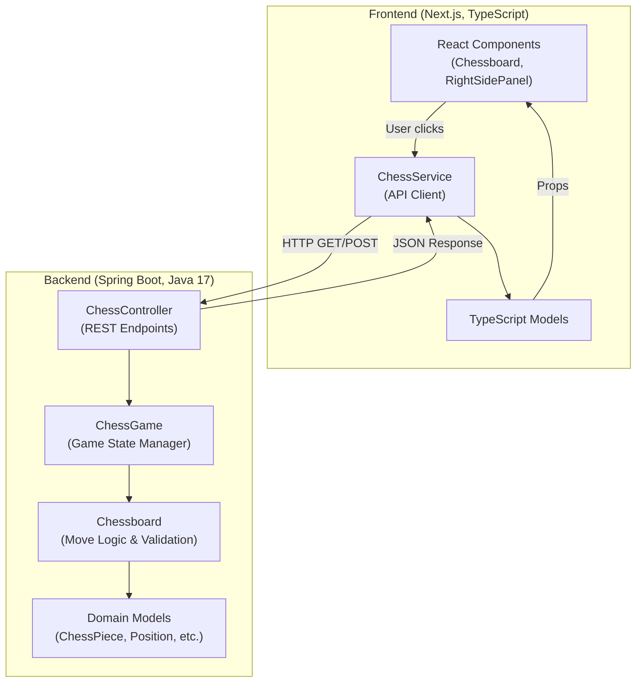

# ChessEngine

## What this repository is

A web-based chess application with a custom chess engine backend and Next.js frontend. The backend is a Spring Boot REST API (Java 17) that implements chess game logic including move validation, check/checkmate detection, en passant, and pawn promotion. The frontend is a React-based TypeScript UI using Next.js 13 that communicates with the backend via HTTP. This is **not** a computer opponent—it enforces rules for two human players on the same machine. It is **not** a distributed multiplayer service.

## Why it exists

This project was created to demonstrate a full-stack chess implementation with RESTful communication between a Java backend and a modern TypeScript frontend. Intended users are developers learning chess engine logic, full-stack development patterns, or seeking a reference implementation of chess rules validation.

## Quickstart

**Prerequisites:**
- Java 17 or higher
- Node.js 18+ and npm (for frontend)
- Gradle wrapper is included

**Run locally:**

1. **Start the backend:**
   ```bash
   cd backend
   ./gradlew bootRun
   ```
   Backend runs on `http://localhost:8080`

2. **Install frontend dependencies (first time only):**
   ```bash
   cd frontend
   npm install
   ```

3. **Start the frontend:**
   ```bash
   cd frontend
   npm run dev
   ```
   Frontend runs on `http://localhost:3000`

4. Open `http://localhost:3000` in your browser to play chess.

**Run tests:**

Backend:
```bash
cd backend
./gradlew test
```

Frontend:
```bash
cd frontend
npm install  # if not already done
npm test
```

**Common troubleshooting:**
- If backend fails to start, ensure Java 17+ is installed: `java -version`
- If frontend build fails, delete `node_modules` and `package-lock.json`, then run `npm install` again
- Backend must be running before frontend can fetch game state
- CORS is configured for `http://localhost:3000` only

## Architecture at a glance



**Data flow:**

1. User interacts with the chessboard UI in the browser.
2. Frontend `ChessService` sends HTTP requests (GET `/chessGame`, POST `/move`, POST `/getValidMoves`) to the Spring Boot backend on localhost:8080.
3. `ChessController` delegates to `ChessGame`, which manages turn state, captured pieces, and game state (check/checkmate).
4. `ChessGame` uses `Chessboard` to validate moves and detect check/checkmate.
5. `Chessboard` applies chess rules and returns results.
6. Backend responds with JSON containing the updated board, turn, and game state.
7. Frontend updates React state and re-renders the UI.

## Core components

**Backend (`/backend/src/main/java/com/backend`):**

- **`ApplicationStart.java`**: Spring Boot main entry point. Starts the REST API server. Also includes a console-based game runner (unused by frontend).
- **`controllers/ChessController.java`**: REST controller exposing endpoints `/startGame`, `/endGame`, `/chessGame`, `/move`, `/getValidMoves`. Manages in-memory game instance (singleton per server run).
- **`domain/ChessGame.java`**: Core game state manager. Tracks turn, captured pieces, game state (Free, Check, Checkmate). Delegates move logic to `Chessboard`.
- **`domain/Chessboard.java`**: Implements chess board representation (8x8 matrix), move validation, check/checkmate detection, en passant, castling, and pawn promotion.
- **`models/`**: Domain models (`ChessPiece`, `Position`, `Color`, `ChessPieceType`, `GameState`).
- **`models/requests/`**: DTOs for HTTP request/response (`ChessGameResponse`, `PositionResponse`, `ChessboardMoveRequest`, etc.).
- **`util/`**: Utility classes (`Util.java` for notation conversion, `Log.java` for static message strings).

**Frontend (`/frontend/src/app`):**

- **`page.tsx`**: Home page (server component). Fetches initial game state and renders `Chessboard` and `RightSidePanel`.
- **`_client_components/Chessboard.tsx`**: Client component rendering the 8x8 board. Handles user clicks, valid move highlighting, and pawn promotion modal.
- **`_client_components/ChessPieceCell.tsx`**: Individual cell with piece rendering.
- **`_client_components/RightSidePanel.tsx`**: Displays turn, game state, and captured pieces.
- **`_client_components/PromotionModal.tsx`**: Modal for pawn promotion piece selection.
- **`_services/ChessService.tsx`**: HTTP client for backend API calls.
- **`_models/`**: TypeScript interfaces mirroring backend models.

**Static assets (`/static`):**
- **`Chessboard.afdesign`**: Design file for the chessboard (Affinity Designer format). Not used at runtime.

**SVG assets (`/frontend/public`):**
- Chess piece SVG images (e.g., `WKing.svg`, `BPawn.svg`, etc.).

## Interfaces

**REST API (Backend):**

- `GET /startGame`: Initializes a new game. Returns `ChessGameResponse` with initial board state.
- `GET /endGame`: Ends the current game and clears state. Returns confirmation message.
- `GET /chessGame`: Returns current game state (board, turn, captured pieces, game state).
- `POST /move`: Accepts `ChessboardMoveRequest` (source, target, optional promotionType). Returns `PositionResponse` (moved piece or error).
- `POST /getValidMoves`: Accepts `Position`. Returns array of valid move positions for the piece at that position.

Example request (move):
```json
POST /move
{
  "source": {"row": 2, "col": 5},
  "target": {"row": 4, "col": 5},
  "promotionType": "Queen"
}
```

**Frontend UI:**

- `/` (home): Main chessboard and game panel.
- `/about`: About page (see `/frontend/src/app/about/page.tsx`).

**No CLI or file I/O**—all interaction is via browser and HTTP.

## Configuration

**Backend:**

- **`application.properties`**: Empty (`/backend/src/main/resources/application.properties`). Spring Boot uses defaults (port 8080, no database).
- **No environment variables required**. All configuration is hardcoded or uses Spring Boot defaults.
- **CORS origins**: Configured in `ChessController.java` as `@CrossOrigin(origins = {"http://localhost:3000/", "http://localhost:3000"})` (line 16 of `/backend/src/main/java/com/backend/controllers/ChessController.java`).

**Frontend:**

- **Backend API URL**: Hardcoded in `/frontend/src/app/_services/ChessService.tsx` as `http://localhost:8080/` (line 8).
- **No environment variables used**. Configuration is in `next.config.js` (default Next.js config), `tsconfig.json`, `.eslintrc.json`.

**Secrets:**

No secrets, tokens, or credentials are required or stored. All communication is localhost HTTP (no TLS, no auth).

## Dependencies and external services

**Backend dependencies** (`/backend/build.gradle.kts`):

- `org.springframework.boot:spring-boot-starter-web` (Spring Boot 3.1.0) — REST API framework
- `org.testng:testng:7.1.0` — Testing framework (though JUnit is also used)
- `org.springframework.boot:spring-boot-starter-test` — JUnit 5 and Spring test utilities

**Frontend dependencies** (`/frontend/package.json`):

- `next` (13.4.4) — React framework
- `react` (18.2.0), `react-dom` (18.2.0) — UI library
- `typescript` (5.1.3) — Type safety
- `eslint`, `eslint-config-next` — Linting
- `jest`, `@testing-library/react`, `@testing-library/jest-dom` — Testing

**External services:**

None. The application runs entirely on localhost with no external API calls, databases, or cloud services.

**Build tools:**

- Gradle 7.6.1 (via wrapper) for backend (`/backend/gradle/wrapper/gradle-wrapper.properties`)
- npm for frontend

## Quality and safety

**Tests:**

- **Backend**: 3 test files in `/backend/src/test/java`:
  - `BackendApplicationTests.java` — Spring context load test
  - `GameStateTest.java` — Tests check and checkmate scenarios
  - `ChessBoardTest.java` — (contents unknown, not inspected)
  - Run with: `cd backend && ./gradlew test`
  - Last run: ✅ Successful (4 actionable tasks executed)

- **Frontend**: 1 test file in `/frontend/src/app/_client_components`:
  - `RightSidePanel.test.tsx` — Tests checkmate rendering
  - Run with: `cd frontend && npm test` (requires `npm install` first)
  - Note: Tests are configured in `jest.config.js`

**CI:**

No GitHub Actions workflows, Travis CI, or CircleCI configurations found. CI is **not configured**.

**Linting and formatting:**

- **Backend**: No linter configured. Code style is not enforced.
- **Frontend**: ESLint configured (`eslint-config-next`). Run with: `npm run lint` or `npm run lint-fix` (see `/frontend/package.json` scripts).

**Static analysis and security:**

- **No static analysis tools** (e.g., SonarQube, SpotBugs) configured.
- **No dependency scanning** (e.g., Dependabot, Snyk) configured.
- **No security scanning** (e.g., OWASP Dependency-Check) configured.

**Build verification:**

Backend builds successfully with `./gradlew build`. Frontend requires `npm install` before build/test.

## Sensitive information review

**Status:** Clean

**Reviewed areas:**

- `/backend/src/main/java` (all Java source files)
- `/backend/src/main/resources/application.properties`
- `/backend/build.gradle.kts`
- `/frontend/src` (all TypeScript files)
- `/frontend/package.json`, `/frontend/next.config.js`, `/frontend/jest.config.js`
- `.gitignore` files in both backend and frontend
- No `.env`, `.env.local`, or environment config files exist in the repository

**Findings:**

- **Hardcoded localhost URLs**: `http://localhost:8080` in `/frontend/src/app/_services/ChessService.tsx` (line 8) and `http://localhost:3000` in `/backend/src/main/java/com/backend/controllers/ChessController.java` (line 16).
  - These are local development URLs, not secrets. Safe for public repositories.
- **No real secrets found**: No API keys, passwords, tokens, private keys, or credentials detected.

**Actions taken:**

None required. Repository is clean.

**Notes:**

- `*.pem` files are excluded by `/frontend/.gitignore` (line 20), which is good practice.
- No environment variable injection mechanisms found.
- No terraform, helm, docker-compose, or cloud configuration files found.
- Binary/design files (e.g., `/static/Chessboard.afdesign`) were not inspected for embedded secrets.

## What's missing

### Documentation
- **P1 / M**: API endpoint documentation (OpenAPI/Swagger spec). Next action: Add Springdoc OpenAPI dependency and annotate endpoints.
- **P2 / S**: Architecture decision records (ADRs) for key design choices. Next action: Document why singleton game instance vs. database.

### Tests
- **P0 / M**: No integration tests for the full frontend-backend flow. Next action: Add a test that starts both services and verifies a complete game flow.
- **P1 / M**: Low backend test coverage (only 3 test files for 16 source files). Next action: Add tests for `Chessboard` move validation edge cases.
- **P1 / S**: No frontend component tests beyond `RightSidePanel.test.tsx`. Next action: Add tests for `Chessboard.tsx` click handlers.

### Security
- **P1 / M**: No HTTPS/TLS for production deployment. Next action: Document production deployment with reverse proxy (e.g., nginx) for TLS termination.
- **P1 / S**: No input validation on backend (e.g., null checks are minimal). Next action: Add bean validation annotations to request DTOs.
- **P2 / M**: No dependency vulnerability scanning. Next action: Enable Dependabot or integrate OWASP Dependency-Check.

### Reliability
- **P0 / L**: Game state is in-memory (lost on server restart). No persistence. Next action: Add database (e.g., H2 or PostgreSQL) and game state serialization.
- **P1 / M**: No error handling for network failures in frontend. Next action: Add retry logic and user-friendly error messages in `ChessService`.
- **P2 / S**: No logging framework (only static log strings). Next action: Replace `Log` utility with SLF4J and configure log levels.

### Operations
- **P0 / M**: No production deployment configuration (Docker, cloud deployment). Next action: Add `Dockerfile` for backend and frontend, and `docker-compose.yml` for local multi-container setup.
- **P1 / M**: No CI/CD pipeline. Next action: Add GitHub Actions workflow for build, test, and Docker image push.
- **P2 / S**: No monitoring or observability (metrics, health checks). Next action: Add Spring Boot Actuator and configure `/health` endpoint.

### Developer experience
- **P1 / S**: No hot reload for backend. Next action: Ensure Spring Boot DevTools is configured (already in `build.gradle.kts`).
- **P1 / S**: No pre-commit hooks for linting or formatting. Next action: Add Husky with `lint-staged` for frontend, Spotless for backend.
- **P2 / S**: No contributing guidelines. Next action: Add `CONTRIBUTING.md` with PR process and code style.

## How this repository is useful

**Reusable patterns:**

1. **RESTful communication between Spring Boot and Next.js**: Clean separation of backend logic (Java) and frontend UI (TypeScript/React). CORS configuration example.
2. **Chess engine logic**: `Chessboard.java` demonstrates move validation, check detection, and special move handling (en passant, castling, promotion). Adaptable for other turn-based board games.
3. **React state management with hooks**: `Chessboard.tsx` shows useState for game state, async API calls, and conditional rendering (promotion modal).
4. **DTO pattern**: Clear request/response objects (`ChessGameResponse`, `ChessboardMoveRequest`) for API contracts.

**Reusable components:**

- `ChessService.tsx`: Generic HTTP client pattern for Next.js API calls.
- `Chessboard` and `ChessPiece` domain models: Transferable to other chess-related projects.

**What future projects can reuse:**

- The chess rule engine (`Chessboard.java`) can be extracted as a library for chess games, puzzles, or AI training.
- The frontend chessboard UI (`Chessboard.tsx`, SVG assets) can be adapted for online multiplayer chess or chess tutoring apps.
- The Spring Boot REST controller pattern is a template for stateful game APIs.

## Automation hooks

**Project type:** Full-stack web application (REST API + SPA)

**Primary domain:** Board games, chess engine, turn-based game logic

**Core entities:**
- `ChessGame` (game state, turns, win conditions)
- `Chessboard` (board representation, move validation)
- `ChessPiece` (piece type, color, position)
- `Position` (row, column coordinates)

**Extension points:**
- **Add AI opponent**: Extend `ChessGame` with a move generator (e.g., minimax algorithm). Safe to add in `/backend/src/main/java/com/backend/ai`.
- **Add multiplayer**: Replace in-memory game storage with a database and add WebSocket support for real-time updates. Requires changes in `ChessController` and `ChessGame`.
- **Add move history**: Add a `List<Move>` to `ChessGame` to track all moves. Safe to add; does not break existing logic.
- **Add themes/UI customization**: Modify CSS in `/frontend/src/app/globals.css` or add theme context in React.

**Areas safe to modify:**
- `/backend/src/main/java/com/backend/util` — Add new utility methods
- `/frontend/src/app/_client_components` — Add new UI components
- `/frontend/public` — Add new SVG assets
- `/backend/src/test` and `/frontend/src/app/_client_components/*.test.tsx` — Add more tests
- `/backend/src/main/resources/application.properties` — Add Spring Boot configuration (e.g., logging, server port)

**Areas requiring caution and why:**
- **`Chessboard.java` move validation logic**: Changes here can break game rules. Requires extensive testing (check, checkmate, en passant edge cases).
- **`ChessController.java` in-memory game instance**: Changing to multi-game support requires major refactoring (e.g., game ID management, session handling).
- **Frontend `ChessService` API URLs**: If backend URL changes, update `ChessService.tsx` line 8 and backend CORS config in `ChessController.java` line 16.
- **Position coordinate system**: Backend uses 1-indexed rows (1-8) and columns (1-8). Frontend adjusts with offsets. Changing this affects both frontend and backend.

**Canonical commands:**

| Task                  | Command                                      |
|-----------------------|----------------------------------------------|
| **Backend: Build**    | `cd backend && ./gradlew build`              |
| **Backend: Test**     | `cd backend && ./gradlew test`               |
| **Backend: Run**      | `cd backend && ./gradlew bootRun`            |
| **Frontend: Install** | `cd frontend && npm install`                 |
| **Frontend: Build**   | `cd frontend && npm run build`               |
| **Frontend: Test**    | `cd frontend && npm test`                    |
| **Frontend: Run (dev)** | `cd frontend && npm run dev`               |
| **Frontend: Lint**    | `cd frontend && npm run lint`                |
