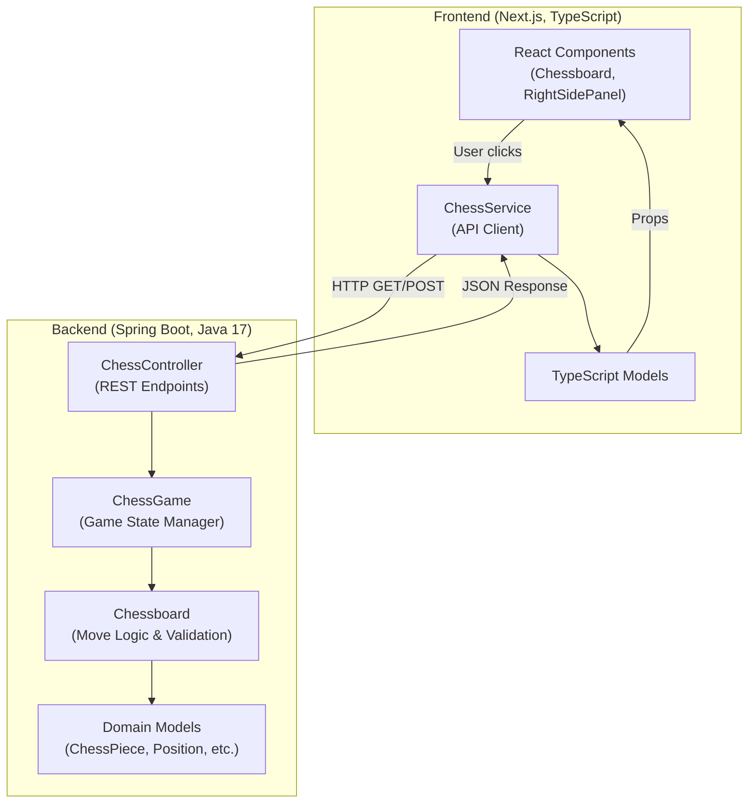

# ChessEngine

A full-stack chess application demonstrating RESTful architecture, chess rule enforcement, and modern web development practices. This is a **reference implementation** of chess game logic with a Spring Boot backend and Next.js frontend—designed for two human players on the same machine.

[](https://github.com/mgierschdev/ChessEngine/actions/workflows/ci.yml)

## What This Repository Is

This project is a **portfolio-grade demonstration** of:

- **Chess Engine Logic**: Complete implementation of chess rules including move validation, check/checkmate detection, en passant, castling, and pawn promotion
- **RESTful API Design**: Clean separation of concerns with a Spring Boot backend exposing chess operations via HTTP
- **Modern Frontend**: React-based TypeScript UI using Next.js 13 with server and client components
- **Full-Stack Integration**: Real-world example of frontend-backend communication with CORS handling

**This is NOT**:
- A chess AI or computer opponent
- An online multiplayer service
- A production-ready deployment platform
- A database-backed application

## Why It Exists

This repository was created to:

1. **Demonstrate chess rule implementation** - A working example of complex game logic including special moves and win condition detection
2. **Showcase full-stack patterns** - Clean architecture with REST API, DTOs, and state management
3. **Serve as a learning resource** - Well-documented code for developers learning chess engines or full-stack development
4. **Provide a reference implementation** - Reusable patterns for turn-based game development

**Intended Audience**: Developers learning chess engine logic, full-stack development patterns, or seeking a reference implementation of chess rules validation.

## Quickstart

### Prerequisites

- **Java 17+** - Backend runtime
- **Node.js 18+** - Frontend runtime  
- **Docker** (optional) - For containerized deployment

### Option 1: Local Development

**Start Backend:**
```bash
cd backend
./gradlew bootRun
```
Backend runs on `http://localhost:8080`

**Start Frontend** (in a new terminal):
```bash
cd frontend
npm install
npm run dev
```
Frontend runs on `http://localhost:3000`

**Open your browser**: Navigate to `http://localhost:3000` and start playing!

### Option 2: Docker

```bash
make docker-up
```
Or manually:
```bash
docker-compose up
```

Access at `http://localhost:3000`

### Option 3: Using Makefile

```bash
make dev        # Run both services locally
make test       # Run all tests
make docker-up  # Start with Docker
```

### Validate Installation

Run end-to-end tests to verify everything works:

```bash
cd e2e-tests
npm install
npx playwright install chromium
npm test
```

This will start both services, run comprehensive tests, and generate a report.

## Architecture at a Glance



**Data Flow**:

1. User interacts with the chessboard UI in the browser
2. Frontend `ChessService` sends HTTP requests to Spring Boot backend
3. `ChessController` delegates to `ChessGame` for game state management
4. `ChessGame` uses `Chessboard` to validate moves and detect check/checkmate
5. `Chessboard` applies chess rules and returns results
6. Backend responds with JSON containing updated board state
7. Frontend updates React state and re-renders the UI

## Configuration

### Environment Variables

| Component | Variable | Default | Description |
|-----------|----------|---------|-------------|
| Frontend | `NEXT_PUBLIC_API_URL` | `http://localhost:8080/` | Backend API URL |
| Backend | `CORS_ALLOWED_ORIGIN` | `http://localhost:3000` | Allowed CORS origin |
| Backend | `SERVER_PORT` | `8080` | Server port (Spring Boot default) |

### Configuration Files

**Frontend** (`frontend/.env.local` - optional):
```bash
NEXT_PUBLIC_API_URL=http://localhost:8080/
```

**Backend** (`backend/src/main/resources/application.properties`):
```properties
# CORS Configuration
cors.allowed-origin=http://localhost:3000

# Springdoc OpenAPI
springdoc.api-docs.path=/api-docs
springdoc.swagger-ui.path=/swagger-ui.html
```

**Docker** (`docker-compose.yml`):
- Backend exposed on port `8080`
- Frontend exposed on port `3000`
- Services communicate via Docker network

## API Documentation

### Swagger UI

Interactive API documentation is available at:
```
http://localhost:8080/swagger-ui.html
```

Start the backend and navigate to Swagger UI to explore endpoints, request/response schemas, and try API calls interactively.

### REST Endpoints

| Method | Endpoint | Description |
|--------|----------|-------------|
| `GET` | `/startGame` | Initialize a new chess game |
| `GET` | `/endGame` | End current game and clear state |
| `GET` | `/chessGame` | Get current game state |
| `POST` | `/move` | Make a chess move |
| `POST` | `/getValidMoves` | Get valid moves for a piece |

### Example API Calls

**Start a game:**
```bash
curl http://localhost:8080/startGame
```

**Get current game state:**
```bash
curl http://localhost:8080/chessGame
```

**Make a move (e2 to e4):**
```bash
curl -X POST http://localhost:8080/move \
  -H "Content-Type: application/json" \
  -d '{
    "source": {"row": 2, "col": 5},
    "target": {"row": 4, "col": 5},
    "promotionType": "Queen"
  }'
```

**Get valid moves for a piece at e2:**
```bash
curl -X POST http://localhost:8080/getValidMoves \
  -H "Content-Type: application/json" \
  -d '{"row": 2, "col": 5}'
```

## Non-Goals

This project **intentionally does NOT include**:

❌ **AI Opponent** - No computer player or move engine  
❌ **Online Multiplayer** - No WebSocket or network play between different machines  
❌ **Persistence** - No database; game state is in-memory only  
❌ **Authentication** - No user accounts or login system  
❌ **Production Hardening** - No load balancing, caching, or cloud deployment  
❌ **Move History Export** - No PGN/FEN notation support  
❌ **Draw Detection** - Stalemate, threefold repetition, 50-move rule not implemented  

These are **design choices**, not oversights. The project focuses on core chess logic and full-stack patterns.

## Known Limitations

### By Design

- **In-Memory Game State**: Game is lost on server restart (no database)
- **Single Game Instance**: Only one game can run per server
- **Two Local Players**: Designed for hotseat play on the same machine
- **No Undo/Redo**: Move history is not tracked
- **No Time Controls**: No chess clocks or time limits

### Future Improvements

The following features are **documented TODOs** for future enhancement:

- [ ] **Stalemate Detection** - Currently not implemented
- [ ] **Castling Through Check** - May not be fully validated (see `ChessRulesTest`)
- [ ] **Pinned Piece Validation** - Edge cases may exist (see `ChessRulesTest`)
- [ ] **Move History** - Track all moves in a game
- [ ] **PGN Export** - Save games in standard chess notation

See disabled tests in `backend/src/test/java/com/backend/domain/ChessRulesTest.java` for details.

## Design Decisions

### Why REST Instead of WebSockets?

- **Simplicity**: RESTful architecture is easier to understand and debug
- **Stateless**: Each request is independent (game state is managed server-side)
- **Use Case**: Two players on the same machine don't need real-time push updates
- **Learning**: Better for demonstrating REST API patterns

### Why Singleton Game Instance?

- **Scope**: Project focuses on chess logic, not multi-tenancy
- **Simplicity**: Avoids session management and game ID complexity
- **Use Case**: Designed for local demonstration, not production scale
- **Alternative**: Multi-game support would require database and session management (out of scope)

### Why Backend Owns Rules?

- **Security**: Client-side validation can be bypassed
- **Single Source of Truth**: Rules enforced in one place
- **Testability**: Easier to test game logic in Java than in UI tests
- **Separation of Concerns**: Frontend handles UI, backend handles business logic

### Why No Database?

- **Focus**: Project demonstrates chess logic and full-stack patterns, not data persistence
- **Simplicity**: In-memory state is easier to reason about and debug
- **Fast Iteration**: No migrations or schema management during development
- **Portability**: Runs anywhere without external dependencies

## Testing Approach

### Backend Tests

**Location**: `backend/src/test/java/`

**Coverage**:
- ✅ **Game State Tests** (`GameStateTest.java`) - Check and checkmate scenarios
- ✅ **Chessboard Tests** (`ChessBoardTest.java`) - Move validation, en passant, promotion, castling
- ✅ **Chess Rules Tests** (`ChessRulesTest.java`) - En passant timing, edge cases (some disabled for future work)
- ✅ **Integration Tests** (`ChessControllerIntegrationTest.java`) - Full API flow testing

**Run Tests**:
```bash
cd backend
./gradlew test
```

**Philosophy**: Focus on chess rule correctness and API contract validation. Edge cases are documented with TODO comments.

### Frontend Tests

**Location**: `frontend/src/app/_client_components/*.test.tsx`

**Coverage**:
- ✅ **Component Rendering** - Chessboard and RightSidePanel render correctly
- ✅ **Game State Display** - Check/checkmate states displayed properly
- ✅ **Smoke Tests** - Components don't crash with various props

**Run Tests**:
```bash
cd frontend
npm test
```

**Philosophy**: Focus on component behavior and rendering. API calls are tested in integration tests.

### End-to-End Tests

**Location**: `e2e-tests/`

**Coverage**:
- ✅ **Application Boot** - Backend and frontend startup validation
- ✅ **Game Initialization** - Board setup and initial state
- ✅ **Legal Moves** - Basic move validation (e2-e4, e7-e5)
- ✅ **Illegal Move Rejection** - Move validation and error handling
- ✅ **Special Rules** - Valid moves API, pawn promotion, castling, en passant
- ✅ **Check and Checkmate** - Fool's Mate detection
- ✅ **Non-Goals Validation** - Documented limitations verification
- ✅ **API Validation** - All REST endpoints
- ✅ **Security Posture** - Authentication, secrets, CORS

**Run Tests**:
```bash
cd e2e-tests
npm install
npx playwright install chromium
npm test
```

**Philosophy**: Black box testing from a real user's perspective. Uses only public interfaces (HTTP API and browser UI). Tests behavior, not implementation.

**CI Integration**: E2E tests run automatically on push via GitHub Actions workflow.

### What's Intentionally Missing

- **Performance Tests**: No load testing (not a production service)
- **Security Tests**: No penetration testing (local HTTP only)

## Security

### Current Security Posture

⚠️ **This project is NOT production-ready.** Security measures are minimal by design.

**What's Implemented**:
- ✅ **CORS**: Restricts cross-origin requests to configured frontend URL
- ✅ **No Secrets**: No API keys, passwords, or tokens required

**What's NOT Implemented**:
- ❌ **HTTPS/TLS**: All communication is plain HTTP
- ❌ **Authentication**: No login or user verification
- ❌ **Authorization**: No access control
- ❌ **Input Sanitization**: Minimal validation beyond chess rules
- ❌ **Rate Limiting**: No protection against spam requests
- ❌ **CSRF Protection**: Not applicable (no session management)

### Security Recommendations for Production

If you want to deploy this publicly:

1. **Use HTTPS** - Add a reverse proxy (nginx, Caddy) with TLS certificates
2. **Add Authentication** - Implement OAuth2 or JWT if tracking users
3. **Input Validation** - Add bean validation annotations to DTOs
4. **Rate Limiting** - Use Spring rate limiting or API gateway
5. **Dependency Scanning** - Enable Dependabot (already configured)
6. **Secret Management** - Use environment variables, never commit secrets

**Recommendation**: Keep this as a localhost-only demo. For production chess, use established platforms.

## Demo

### Screenshots

> **TODO**: Add screenshots of:
> - Chessboard in initial state
> - Valid move highlighting
> - Checkmate state
> - Pawn promotion modal

### Live Demo

No live demo is hosted. Run locally with `make dev` or `make docker-up`.

## Roadmap

### Planned Enhancements

- [ ] **Extract Chess Engine** - Separate core logic into reusable library
- [ ] **Stalemate Detection** - Implement draw by stalemate
- [ ] **Move History** - Track and display all moves in a game
- [ ] **PGN/FEN Support** - Import/export games in standard notation
- [ ] **Undo/Redo** - Allow players to take back moves
- [ ] **Optional AI Opponent** - Basic minimax algorithm (future module)

### Not Planned

- ❌ **Online Multiplayer** - Out of scope (use dedicated platforms)
- ❌ **Database** - Intentionally in-memory
- ❌ **User Accounts** - Not applicable for local hotseat play
- ❌ **Production Deployment** - Demo project, not a service

## Contributing

Contributions are welcome! Please read [CONTRIBUTING.md](CONTRIBUTING.md) for:

- Development setup
- Code style guidelines
- Testing requirements
- Pull request process
- What contributions are accepted

**Quick Links**:
- [Open an Issue](https://github.com/mgierschdev/ChessEngine/issues)
- [Submit a Pull Request](https://github.com/mgierschdev/ChessEngine/pulls)
- [View Contributing Guide](CONTRIBUTING.md)

## License

This project is open source. See LICENSE file for details (if available).

## Acknowledgments

- Chess piece SVGs from public domain sources
- Spring Boot and Next.js communities
- Contributors and testers

---

**Built with**: Java 17, Spring Boot 3.1, Next.js 13, TypeScript 5, React 18

**Maintained by**: [mgierschdev](https://github.com/mgierschdev)
